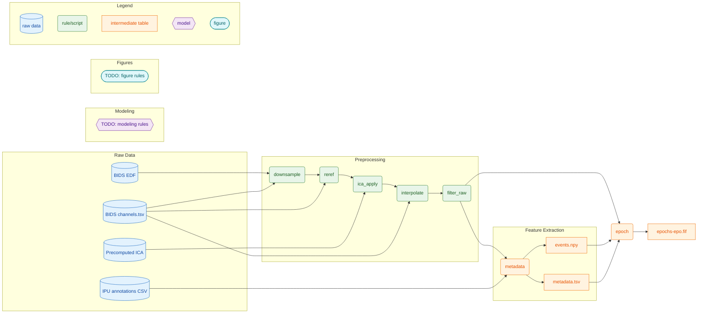

# EEG Hyperscanning Preprocessing

## TODO
- current branch most likely fine. Ensure its integrity ("hyperscanning-testing") by running turn-taking pipeline to be 100% sure
- precomputed ICA handling

Scientific Snakemake pipeline for [FIELD]. This repository defines a deterministic preprocessing workflow for BIDS-formatted EEG data with subject/task/run granularity. The main entrypoint is `workflow/Snakefile` and configuration is provided via YAML (`config/config.yaml`).

Associated manuscript: [citation or in prep]

## Scope and Data Flow

This pipeline currently implements the preprocessing chain and metadata/epoch generation described in `workflow/rules/preprocessing.smk`. Rule dependencies are explicit in the Snakemake DAG and are shown below. Outputs are reproducible given the same inputs and config.

Raw inputs (BIDS):
- `*_eeg.edf` (raw EEG)
- `*_channels.tsv` (channel metadata)
- `*_ipu.csv` (IPU annotations)
- Precomputed ICA: `{subject}_task-{task}-ica.fif`

Intermediate outputs (derived):
- Downsampled raw: `*_raw_ds.fif`
- Rereferenced raw: `*_raw_reref.fif`
- ICA-applied raw: `*_raw_ica.fif`
- Interpolated raw: `*_raw_interp.fif`
- Filtered raw: `*_raw_filt.fif`
- Metadata table: `*_metadata.tsv`
- Events array: `*_events.npy`
- Epochs: `*_epochs-epo.fif`
- Canary marker: `derived/canary/all.done`

## Pipeline Diagram (Snakemake DAG)



Diagram notes:
- Guarantees enforced: `metadata.tsv` is produced by aligning IPU annotations within a fixed time window; each row corresponds to one anchor IPU with partner features and latency (see `workflow/rules/preprocessing.smk` and `src/hyper/preprocessing/metadata.py`).
- Deterministic regeneration: fixed seeds, single-thread defaults in rules, and stable sort operations in comparators ensure reproducible outputs given identical inputs and config.
- To regenerate the full DAG: run Snakemake against `workflow/Snakefile` with your config and data paths (see below).

## Configuration

- Config file: `config/config.yaml`
- Key paths (from config): `paths.bids_root`, `paths.derived_root`, `paths.annotation_root`
- Task/run selection: `tasks.include`, `runs.include`
- Canary slice: `canary.subject`, `canary.task`, `canary.run`

## Running the Pipeline

From the repository root:

```bash
snakemake -s workflow/Snakefile --cores 1
```

To run the canary target only:

```bash
snakemake -s workflow/Snakefile derived/canary/all.done --cores 1
```

## Outputs and Reproducibility

- Output artifacts are stored under `paths.derived_root` as specified in the YAML config.
- All outputs are regenerated deterministically as long as input data, config, and software environment are unchanged.
- Use the canary target to validate end-to-end changes on a minimal slice.

## Testing

- Unit tests: `pytest tests/hyper -q`
- Integration (canary regression): `pytest -m integration -q`

## Documentation

Sphinx documentation sources are in `docs/`.

Build:

```bash
python -m pip install -r docs/requirements.txt
sphinx-build -b html docs docs/_build/html
```

## Notes for Reviewers

- Rule dependencies are explicit in the Snakemake DAG and shown above.
- All intermediate files are retained under the derived root to allow auditing and reanalysis.
- TODO items in the diagram indicate stages that are planned but not yet defined in this repository.
